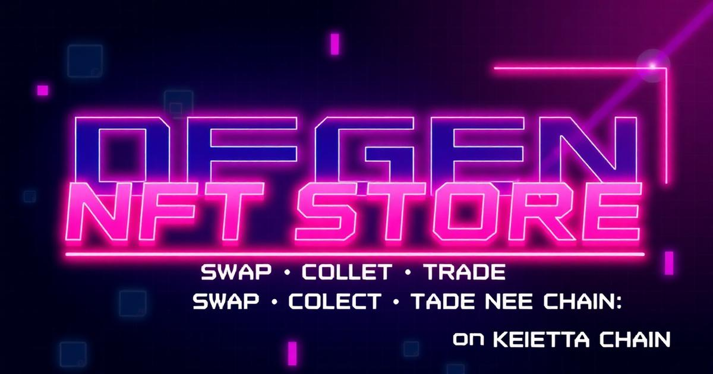

# 🎮 DEGEN NFT Store

> **8-bit NFT Marketplace & Token Swap on Keeta Chain**

A retro-futuristic NFT marketplace featuring pixel art aesthetics, KTA/XRGE token swaps, and a social network for the DEGEN community.



## ✨ Features

### 🔥 Live Features
- **Token Swap**: Seamless KTA/XRGE swaps with real-time rates
  - BASE chain market price display
  - Internal liquidity pool rates
  - Slippage protection
  - Loading states and error handling
- **Wallet Integration**: Full Keeta Chain wallet support
  - Generate new wallets with 24-word mnemonic
  - Import existing wallets
  - Send KTA and XRGE tokens
  - Real-time balance updates
- **FX Anchor**: Self-hosted liquidity pool for token swaps
- **Responsive Design**: Mobile-first 8-bit aesthetic with neon glow effects

### 🚧 Coming Soon
- NFT Collection browsing and trading
- Social Activity Feed
- User Profiles & Collections
- NFT Detail pages with comments

## 🛠️ Technology Stack

- **Frontend**: React 18 + TypeScript + Vite
- **Styling**: Tailwind CSS with custom 8-bit pixel design system
- **Backend**: Lovable Cloud (Supabase)
  - Edge Functions for swap logic and anchor operations
  - Secrets management for wallet seeds
- **Blockchain**: Keeta Chain SDK
  - secp256k1 wallet derivation
  - KTA and XRGE token support
  - Mainnet deployment
- **External APIs**:
  - DexScreener for BASE chain market data
  - Custom FX anchor for internal swap rates

## 🚀 Getting Started

### Prerequisites
- Node.js 18+
- npm or bun

### Installation

```bash
# Clone the repository
git clone <YOUR_GIT_URL>

# Navigate to the project directory
cd <YOUR_PROJECT_NAME>

# Install dependencies
npm i

# Start development server
npm run dev
```

### Environment Variables

The project uses Lovable Cloud with auto-configured environment variables:
- `VITE_SUPABASE_URL`
- `VITE_SUPABASE_PUBLISHABLE_KEY`
- `VITE_SUPABASE_PROJECT_ID`

Additional secrets are managed via Supabase:
- `ANCHOR_WALLET_SEED`: FX anchor wallet seed hex (64 chars)
- `LOVABLE_API_KEY`: AI gateway access (auto-provided)

## 📖 Usage

### Wallet Setup
1. Click "Connect Wallet" in the navigation
2. Generate a new wallet or import existing mnemonic
3. Your wallet will be stored locally in browser storage

### Token Swap
1. Navigate to the Swap page
2. Select token pair (KTA ↔ XRGE)
3. Enter swap amount
4. Review rates and slippage tolerance
5. Confirm swap transaction

### Send Tokens
1. Open wallet dialog
2. Click "SEND" tab
3. Select token (KTA or XRGE)
4. Enter recipient address (must start with `keeta_`)
5. Enter amount and confirm

## 🎨 Design System

The project uses a custom 8-bit pixel aesthetic with:
- **Colors**: Neon cyan/magenta glow effects
- **Typography**: Pixelated fonts for headers
- **Components**: Custom pixel borders and retro UI elements
- **Animations**: Smooth transitions with pixel-perfect details
- **Dark Mode**: Full dark theme support

Key CSS classes:
- `.neon-glow`: Cyan neon text effect
- `.neon-glow-secondary`: Magenta neon text effect
- `.pixel-border`: 2px retro border
- `.pixel-border-thick`: 4px bold border

## 🔐 Security

- Wallet seeds stored locally (never sent to server)
- RLS policies on database tables
- Slippage protection on swaps
- Input validation for addresses and amounts
- CORS configuration on edge functions

## 📝 Project Structure

```
.
├── src/
│   ├── components/       # React components
│   ├── pages/           # Page components
│   ├── contexts/        # React contexts (Wallet)
│   ├── hooks/           # Custom hooks
│   ├── lib/             # Utilities
│   └── integrations/    # Supabase integration
├── supabase/
│   └── functions/       # Edge functions
│       ├── fx-swap/           # Token swap logic
│       ├── fx-rates/          # Rate calculation
│       ├── fx-market-data/    # DexScreener integration
│       └── fx-anchor-info/    # Anchor wallet status
├── public/              # Static assets
└── index.html          # Entry point with metadata
```

## 🤝 Contributing

This is a Lovable project. Contributions are welcome!

1. Fork the repository
2. Create a feature branch
3. Make your changes
4. Submit a pull request

## 📄 License

MIT License - feel free to use this project for your own purposes.

## 🔗 Links

- **Project URL**: https://lovable.dev/projects/efe6eb1b-d6f2-49aa-8808-e533d28567c5
- [Keeta Network](https://keeta.network)
- [Lovable Documentation](https://docs.lovable.dev)

## 💬 Support

For issues or questions:
- Open an issue on GitHub
- Check [Lovable Docs](https://docs.lovable.dev) for help
- Join the DEGEN community

---

Built with 💜 by the DEGEN community | Powered by Keeta Chain & Lovable

